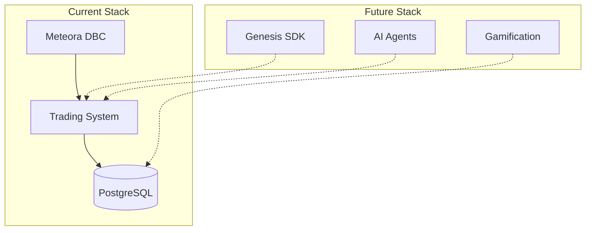

# Kogaion Technical Stack

Complete technical documentation of Kogaion's infrastructure, protocols, and future integrations.

## Overview

Kogaion is built on cutting-edge Solana infrastructure, combining multiple protocols to create a unique token launchpad experience. Our stack evolves from foundational bonding curve mechanics to advanced AI-powered autonomous agents.

---

## 1. Meteora Dynamic Bonding Curve (DBC)

**Status**: ✅ Currently Implemented

### What is Meteora DBC?

Meteora's Dynamic Bonding Curve is an on-chain protocol for token launches that uses a bonding curve mechanism for price discovery. Tokens start on a virtual bonding curve and automatically graduate to permanent liquidity pools (DAMM v2) when certain conditions are met.

### How It Works on Kogaion

- **Token Launches**: All tokens are launched on Meteora DBC pools
- **Trading Fee**: 1.5% (150 basis points) total per trade
- **Fee Distribution**:
  - 20% → Meteora Protocol (0.3%)
  - 80% → Partner + Creator Share (1.2%)
  - Currently: 100% of partner share goes to Kogaion Treasury
  - Future: Revenue sharing program for creators (planned)

### Pool Configuration

- **Pool Config Key**: `BySD2vRKkCPmaH5A5MH3k5quRe8V23yhk9cKKTR5sv5t`
- **Quote Mint**: wSOL (So11111111111111111111111111111111111111112)
- **Fee Claimer**: Treasury wallet (`5hDrp6eTjMKrUFx96wqeQHhXNa7zvp3ba1Z9nTY3tBjA`)
- **Leftover Receiver**: Treasury wallet
- **Creator Trading Fee Percentage**: 0% (all fees to partner/treasury)
- **Migration**: Automatic graduation to DAMM v2 when bonding curve reaches 100%

### Implementation Details

**SDK**: `@meteora-ag/dynamic-bonding-curve-sdk`

**API Endpoints**:
- `POST /api/create-pool-transaction` - Creates DBC pool transaction
- `POST /api/swap-transaction` - Creates swap (buy/sell) transaction
- `POST /api/swap-quote` - Gets swap quote estimate

**Code References**:
- `src/pages/api/create-pool-transaction.ts` - Pool creation logic
- `src/pages/api/swap-transaction.ts` - Trading logic
- `src/lib/config.ts` - Pool config key configuration

### Resources

- [Meteora DBC Documentation](https://docs.meteora.ag/overview/products/dbc)
- [DBC Fee Calculation](https://docs.meteora.ag/overview/products/dbc/dbc-fee-calculation)
- [Pool Configuration Guide](https://docs.meteora.ag/developer-guide/guides/dbc/bonding-curve-configs)

---

## 2. Genesis SDK (Metaplex)

**Status**: 🔜 Planned Integration (Q2 2026)

### What is Genesis SDK?

Genesis SDK is a public development toolkit released by Metaplex in December 2024 at Solana Breakpoint. It standardizes token launches on Solana with audited smart contracts, fair-launch mechanisms, and real-time data access.

### Key Features

- **Plug-and-Play Fair Launch**: Standardized contracts, no custom development needed
- **Audited Smart Contracts**: Improved security, fewer vulnerabilities
- **Transparency & Tokenomics**: On-chain visibility for distribution, vesting, supply
- **Real-Time Data Integration**: Instant tracking for new token deployments

### Integration Plan

**Phase 1**: Research & Testing (Q1 2026)
- Evaluate Genesis SDK capabilities
- Test integration with existing DBC infrastructure
- Compare with current launch mechanism

**Phase 2**: Optional Integration (Q2 2026)
- Allow creators to choose between DBC and Genesis SDK
- Implement hybrid approach: DBC for bonding, Genesis for tokenomics
- Maintain backward compatibility

**Phase 3**: Full Integration (Q3 2026)
- Unified launch experience
- Enhanced tokenomics transparency
- Better security through audited contracts

### Use Cases

- **Token Generation Events (TGE)**: Standardized fair launches
- **Whitelist + Public Rounds**: Fast whitelist rounds (e.g., DeFiTuna: 3 min whitelist, 1 min public)
- **Better Tokenomics**: On-chain visibility for all token parameters

### Early Adopters

Projects already using Genesis SDK:
- DeFiTuna
- Pipe Network
- Portals
- Play Solana

### Resources

- [Metaplex Genesis SDK](https://www.metaplex.com/genesis)
- [Solana Breakpoint 2024 Announcement](https://solana.com/news)
- [Genesis SDK GitHub](https://github.com/metaplex-foundation/genesis-sdk)

---

## 3. Autonomous AI Agents (Solana AI Stack)

**Status**: 🔮 Future Vision (2026-2027)

### What are Autonomous AI Agents?

Autonomous AI agents are software systems that perceive data, reason, and act on behalf of users (or themselves) without continuous human input. On Solana, this means agents can perform on-chain actions, interact with protocols, and manage assets autonomously.

### Available Technology Stack

#### 1. Solana Agent Kit (SendAI)

- **60+ Solana Actions**: Token swaps, bridging, DeFi interactions, NFT management
- **Model Agnostic**: Compatible with any AI model (OpenAI, Claude, Gemini, etc.)
- **Language**: TypeScript/JavaScript
- **GitHub**: [sendaifun/solana-agent-kit](https://github.com/sendaifun/solana-agent-kit)

#### 2. ElizaOS Framework

- **TypeScript Framework**: Full-stack agent development
- **Wallet Integration**: Native Solana wallet support
- **Protocol Actions**: Direct integration with Solana protocols
- **Social Platforms**: Support for agent-to-agent communication

#### 3. Coral Protocol

- **"AI Agents on Demand"**: Rent agents, build agent-powered apps
- **Monetization**: $CORAL token for agent usage
- **Marketplace**: Agent marketplace for developers
- **Hackathon**: "Internet of Agents Hackathon" with thousands of developers

#### 4. Solana-Agent (Python)

- **Multi-Agent Swarms**: Coordinate multiple agents
- **Built-in Memory**: Persistent agent memory
- **Multi-Modal Inputs**: Text, images, on-chain data
- **Event Triggers**: Autonomous actions based on events

### Use Cases for Kogaion

#### Token AI Agents

Each token launched on Kogaion can have its own AI agent that:
- **Community Engagement**: Manages Telegram, Twitter interactions
- **Market Analysis**: Provides insights and analytics
- **Automated Responses**: Answers questions, provides updates
- **Trading Signals**: Optional trading recommendations (with permissions)

#### Platform AI Agents

- **Discovery Agent**: Recommends tokens based on user preferences
- **Fraud Detection**: Identifies suspicious activity
- **Market Making**: Optional automated liquidity provision

### Implementation Roadmap

**Phase 1**: Solana Agent Kit Integration (Q3 2026)
- Basic token bot functionality
- Community engagement features
- Simple automated responses

**Phase 2**: ElizaOS Upgrade (Q4 2026)
- Advanced personality customization
- Multi-platform support
- Enhanced analytics

**Phase 3**: Autonomous Trading (2027)
- Optional trading agents (with explicit user permissions)
- Portfolio management
- DCA strategies

### Privacy & Security

- **TEE (Trusted Execution Environment)**: Privacy-preserving agent interactions
- **Zero-Knowledge Proofs**: ZKP for agent operations
- **Agent Identity Verification**: Credentialing and reputation systems

### Resources

- [Solana AI Developers](https://solana.com/developers/ai)
- [Solana Agent Kit](https://github.com/sendaifun/solana-agent-kit)
- [Coral Protocol](https://coral.xyz/)
- [ElizaOS Framework](https://elizaos.github.io/)

---

## Architecture Overview

---

## API Reference

### Token Operations

- `POST /api/create-pool-transaction` - Create DBC pool
- `POST /api/swap-transaction` - Execute swap
- `POST /api/swap-quote` - Get swap quote
- `GET /api/tokens` - List tokens
- `GET /api/tokens/[mint]` - Get token details

### Trading

- `POST /api/token-balance` - Get user token balance
- `POST /api/send-transaction` - Send signed transaction

### Community

- `GET /api/comments/[mint]` - Get token comments
- `POST /api/comments/[mint]` - Post comment
- `GET /api/leaderboard` - Get creator leaderboard
- `GET /api/referral` - Get referral stats
- `POST /api/referral` - Track referral

---

## Development Roadmap

1. **Q1 2026**: Foundation (Current)
   - Meteora DBC integration ✅
   - Basic trading ✅
   - Token discovery ✅

2. **Q2 2026**: AI & Genesis
   - Genesis SDK integration
   - Advanced AI bot features
   - Personality builder v2

3. **Q3 2026**: Gamification
   - Pack Levels system
   - Revenue sharing program
   - Achievement badges

4. **Q4 2026**: Autonomous Agents
   - Full AI agent integration
   - Multi-agent swarms
   - Advanced analytics

5. **2027**: Advanced Features
   - Cross-chain support
   - White-label solutions
   - Mobile app

---

## Resources & Links

### Documentation
- [Meteora DBC Docs](https://docs.meteora.ag/)
- [Metaplex Genesis SDK](https://www.metaplex.com/genesis)
- [Solana AI Developers](https://solana.com/developers/ai)

### GitHub Repositories
- [Meteora DBC SDK](https://github.com/MeteoraAg/dynamic-bonding-curve)
- [Solana Agent Kit](https://github.com/sendaifun/solana-agent-kit)
- [ElizaOS](https://github.com/elizaos/eliza)

### Community
- [Solana Discord](https://discord.gg/solana)
- [Meteora Discord](https://discord.gg/meteora)

---

**Last Updated**: January 2026

**Maintained by**: Kogaion Development Team
